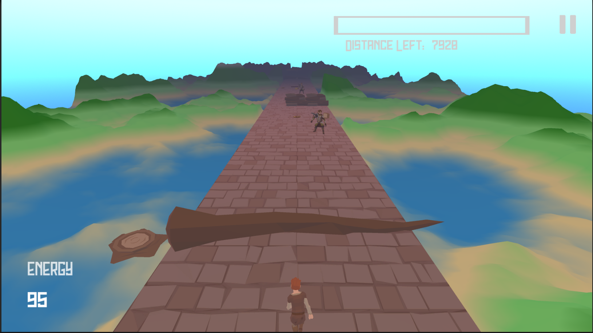

**The University of Melbourne**
# COMP30019 – Graphics and Interaction

Final Electronic Submission (project): **4pm, November 1**

Do not forget **One member** of your group must submit a text file to the LMS (Canvas) by the due date which includes the commit ID of your final submission.

You can add a link to your Gameplay Video here but you must have already submit it by **4pm, October 17**

# Project-2 README

You must modify this `README.md` that describes your application, specifically what it does, how to use it, and how you evaluated and improved it.

Remember that _"this document"_ should be `well written` and formatted **appropriately**. This is just an example of different formating tools available for you. For help with the format you can find a guide [here](https://docs.github.com/en/github/writing-on-github).

**Get ready to complete all the tasks:**

- [x] Read the handout for Project-2 carefully.

- [x] Brief explanation of the game.

- [x] How to use it (especially the user interface aspects).

- [x] How you designed objects and entities.

- [x] How you handled the graphics pipeline and camera motion.

- [x] The procedural generation technique and/or algorithm used, including a high level description of the implementation details.

- [x] Descriptions of how the custom shaders work (and which two should be marked).

- [x] A description of the particle system you wish to be marked and how to locate it in your Unity project.

- [x] Description of the querying and observational methods used, including a description of the participants (how many, demographics), description of the methodology (which techniques did you use, what did you have participants do, how did you record the data), and feedback gathered.

- [x] Document the changes made to your game based on the information collected during the evaluation.

- [x] References and external resources that you used.

- [x] A description of the contributions made by each member of the group.

## Table of contents
* [Team Members](#team-members)
* [Explanation of the game](#explanation-of-the-game)
* [Technologies](#technologies)
* [Using Images](#using-images)
* [Code Snipets ](#code-snippets)

## Team Members

| Name | Task | State |
| :---         |     :---:      |          ---: |
| Pablo Li | Core game logic, game design, animation, Demo video, report |  Done |
| Emily Zhou | Shader, Animation, Report | Done |
| Qingying Lyu | Shader, Sky box, UI,Particle system, Report | Done |
| Xinwei Qian | Demo video, README, UI , Evaluate methods | Done |

## Explanation of the game
The game is an endless runner. The player controls a character that automatically runs forward and has to dodge incoming obstacles. The player also has an energy level that is constantly decreasing and must maintain an energy level above 0 by collecting foods. The player can also pick up speed modifiers, which as the name suggest, tempporarily change the player's speed. 

The player can lose either by colliding with an obstacle or reaching an energy level of 0.

There are two game modes that the player can play. The first one is Story Mode, where the player has to run a certain distance to win the game. The other is an infinite mode, where the player runs until the player loses

## How to use the game

The game initially launches the game's main menu. The player can start the game by clickin on the "Start" button, then the player can choose which game mode they want to play. The player can change the game settings by clikcing on "Settings" and quit the game by clicking on "Exit".

  

  

The game controls are as follow:

Press "A" to move to the left.

Press "D" to move to the right

Press the space bar to jump

Press "S" slide under obstacles

Pres the escape key or click the pause button at the top right of the screen, to pause the game.

  

In the pause menu, the player can click on "Resume" to continue with the game.

  

In the menu that appears after the player loses, the player can click on "Restart" to restart the game

  

In the menu that appears after winning the game, the player can clikc on "Play again" to play the game again.

  

In all menus, the player can click on "Main Menu" to go to the main menu.

## Technologies
Project is created with:
* Unity 2021.1.13f1
* Ipsum version: 2.33
* Ament library version: 999

## Objects and entities design

The game uses object pooling design pattern as it main pattern. The platform the player runs on, the obstacles, and the power ups are all done via object pooling since all of these objects are getting constantly recycled, so object pooling will improve game efficiency, compared to  constantly instantiating and destroying objects. 

The platform the player runs on is a pool of a single prefab tile which includes a main road where the player is running on. Then there are two empty objects attached to the tile which have the script to generate the procedurally generated terrain. After the player is a certain distance from a tile, such that it is behind the player, the tile gets moved to the end of the road, respawning the obstacles and power ups, as well as changing the parameters of the procedurally generated terrain, specifically, the Perlin noise is shifted by a calculated offset, so the terrain looks continuous.

  

The obstacle pool contains all the obstacles that the game uses. Each unique obstacle is instantiated a certain number of times at the beginning of the run and is disabled. The behaviour and appearance of each obstacle is changed depending on which game the phase is on. Each phase is determined by the current time since the player has loaded the level and is indicated by the attribute “PHASE_LIMIT” in the Constants class. For example, PHASE_LIMIT[0] indicates the second at which phase 0 finishes. There are 3 phases in the game. After phase 2 is reached, it remains phase 2 until the game ends. The behaviour of each obstacle is described below:

Wide Wall: the walls spawn in two random lanes. In phase 0, the walls are low enough that the player can jump over them. In phase 1, the player can no longer jump over them, and they change to a dark grey material colour. In phase 2, when the walls are spawned, all three lanes are covered, and one of the walls will randomly disable once the player is withing a certain distance from the wall

  

Flame puker: This obstacle uses the particle system to simulate a horizontal flame. The flame covers all three lanes and is at a certain distance above the ground, so that the player cannot go pass it without sliding under it. This obstacle does not change in behaviour in each phase.

  

Ground spikes: Spikes come out from the ground periodically, entering a short cooldown period between each cycle where they do not go up. In phase 0, the gate of the spikes only spawns in one of the lanes, allowing the player to know in which lane it is beforehand. In phase 1, all three lanes include a gate, however, the spike only comes up from one of the gates. In phase 2, the spikes have a chance of instantly reaching their maximum height, like an “instant trigger”, which may catch the player by surprise. This ignores the cooldown period.

  

Tree log: it’s a fallen tree that covers all three lanes, and spawns above the ground, so they player is obligated to jump over it. Its behaviour does not change in each phase.

  

Oscillator: it oscillates between 2 adjacent lanes periodically. In phase 0, the oscillator is low enough that the player can jump over it. In phase 1, the player can no longer jump over it and the oscillation speed increases. In phase 2, the oscillator not longer oscillates between two lanes. Instead, it remains in one lane for a certain period, and then teleports to the other lane. This is so it may catch the player by surprise.

  

The power up pool works similarly to the obstacle pool. However, the behaviour of each power up depends on their position to the centre of the tile, and the type. There are two types of power ups, which have scripts that are child classes of a PowerUp script parent class.

If the power up is a food type, the food provides a base amount of energy. The energy that the food provides will depend on the distance to the centre of the tile. Foods closer to the centre of the tile will provide a greater amount of energy, while foods further away will provide less. 

If the power up is a SpeedModifier type, the power up modifies the speed of the player temporarily.

For the user interfaces, canvases were used. For the in-game UI, the player is shown its current energy level, the distance left to run in the case of the story mode, and the current distance in the case of the endless mode. A pause button is included. The energy level display becomes red once the player is below a certain energy level. The pause, lose, win and main menu contain buttons to different functions, such as starting the game, restarting the game, quitting the game and going back to the main menu. 

The chosen objects and entities match the game setting and the story mode. All models, particle systems and shaders are designed in low poly for aligned style. Most models of building structure, obstacles, characters, and environmental objects are from a package “PolygonFantasyKindom”. The models are in medieval style that suits the game setting in a kingdom ruled by a tyrant. Some other packages are also used, including “A_piece_of_nature”, “Fantasy Forest Set” and “AurynSky” for increased variety in the game’s natural environment.

## Graphics pipeline and camera motion

### Graphics pipeline

In the blend shader, the vertext position of game objects are converted from local to world space by "UnityObjectToClipPos()". This function allows the vertex shader to run faster by omitting the last component in float4, which does not impact the current game. The colors of material are passes unchanged. The normal of each vertex are also converted to world space by multipling the world matrice for calculating reflected and specular lights in the fragment shader.

The fog shader is also a fragment shader, which means that this shader receives the data for each fragment and outputs the color. This shader will process all pixel in screen since it is for full screen. The details will be [Fog shader](#fog-shader)

### Camera motion

The camera is always behind and above the player, rotating down along the z axis to be able to see the player and the obstacles ahead.

In the core scene, the camera always maintains a certain distance behind the character due to the nature of the game. The player can barely notice the impacts from the camera motion since it is moving continuously in a single direction as the character does.

The starting and ending scene are depicted with more complicated camera motion by rotating and moving the camera in various directions. The starting scene gives a comprehensive view of the castle at first, then rotates the camera down to focus on the characters motion of escaping from the castle. It is followed by more rotation and descending motion to approach the character smoothly. The camera motions allow players to have a clearer understanding of the story and connect to the game scene.

The ending scene starts with following the character at the back as a transition from the game scene. This perspective also provides a comprehensive view of the destination to the player that arouses a sense of satisfaction and fulfilment after winning the game. When the character arrives at his home and meet his loved one, the camera slowly rises and rotates to highlight their reunion and closes the scene.

## Procedural generation algorithm

The procedural generation was done on the terrains at the side of the road. This is done by first creating a number of points ordered in a square shape, and then a plain mesh is created by creating triangles using the points. To create the terrain, the following algorithm is used:

Various layers of Perlin noise map are applied to a single point’s height. This is controlled by 3 parameters: frequency, amplitude, and the number of octaves. Each octave is a layer of noise. The frequency parameter is controlled by another parameter, lacunarity, which is a value greater than or equal to 1. In each octave, the frequency of the noise is increased exponentially, which allows the terrain to have greater number of details, such as more frequent bumps or troughs. Amplitude is controlled by a persistence parameter, which is between 0 and 1. As the octave number increases, the amount each octave contributes to the final height decreases, since after the value from the current octave is added to the final height, the amplitude is multiplied by the persistence, which will exponentially decrease the amplitude value. This allows to create a smoother and more natural looking terrain. 

  

Image from: https://www.youtube.com/watch?v=wbpMiKiSKm8&list=PLFt_AvWsXl0eBW2EiBtl_sxmDtSgZBxB3

There is also an array of values that will be used to offset the noise map. This is controlled by a seed, which is used to create a Random object, where each offset array is generated with. This allows the generation of a different terrain in each game run as the noise map is offset a different random amount each time, by inputting a different random seed in each game.

The implementation is as follow:

1-	The x and z coordinate of each point is taken. For each of the values, the random offset is added, as well as a manual offset. This is then multiplied by the frequency and divided by the scale.

2-	The new x and z values are passed into the Perlin noise method to create a single noise value, which is then multiplied by the amplitude.

3-	Frequency is multiplied by the lacunarity, and the amplitude is multiplied by the persistence before applying the next octave.

4-	To clamp all the heights between 0 and 1, each height is divided by the maximum height a point is allowed to be. The max height is calculated by summing the amplitudes. This is described by the following function: 

h(c) = a * p ^ (c),

 where 'a' is the initial amplitude, 'p' is the persistence value and 'c' is the octave number.

So max height = sum(h(c)) from c = 0 to number of octaves

5-	An animation curve is then used to modify the height of each point, so lower heights are assigned a similar height. This allows the create flatter sections of land, and the higher heights will be closer to their original height, thus creating a mountainous terrain. A conceptual illustration is shown below:

  

The animation curve used for the terrains (heights are inverted):

  

The way the animation curve works is as follow: the Evaluate() method from the AnimationCurve class is used to evaluate each height, which is then mapped to the corresponding value in the graph. Then it is assigned as the height of that point

6-	Finally, each point is multiplied by a maximum height parameter, after the animation curve is applied, to make the terrain to be of a desired height.

7-	The heights are sent to the shader to determine what to colour each point, depending on its height.

# Descriptions of how the custom shaders work

## Blend shader

In the blend shader, the vertext position of game objects are converted from local to world space by "UnityObjectToClipPos()". This function allows the vertex shader to run faster by omitting the last component in float4, which does not impact the current game. The colors of material are passes unchanged. The normal of each vertex are also converted to world space by multipling the world matrice for calculating reflected and specular lights in the fragment shader.

The blend shader is a fragment shader that gives colour transition and diffused reflection on objects’ surface. With the object’s normal obtained from each vertex and the light direction using “_WorldSpaceLightPos0”, the reflection effect is applied to each fragment that the normal and light direction are not parallel (the vectors’ dot product greater than 0). The float variable “atten” determines the strength of reflection. “UNITY_LIGHTMODEL_AMBIENT” gives the colour of reflection light and adds up onto the object’s original material.

“_BlendFct” is a float variable that controls the colour transition on objects’ surface. It fluctuates between 0 and 1 by the pattern of a non-negative sin graph. “_BlendColor” is a public Color attribute allows setting different blending colours on objects before rendering in Unity.

The specular highlight is also added up onto the final relfected light value in blend shader. It is calculated by the difference of position between the camera and the vertex that determines how much light is seen by the player in the scene. Specular highlight is preset to white light with (1, 1, 1) rgb value in "_SpecColor". "_Shininess" is a float variable that detrmines the strength of the specular reflection.

The Blend shader is mainly demonstrated by emphasising the power ups in the core scene. The power ups are highlighted in various colour that encourage player to catch as part of the play to win. The shader is also used to enrice the animation by lighting up valuable objects and the structures in palace.

  

### Paths to the source files
- Blend shader: https://github.com/Graphics-and-Interaction-COMP30019-2021/project2-project2_group_25/blob/master/Protoype/Assets/Scripts/Shader/BlendShader.shader
- BlendEffect script: https://github.com/Graphics-and-Interaction-COMP30019-2021/project2-project2_group_25/blob/master/Protoype/Assets/Scripts/Shader/BlendEffect.cs

  

## Fog shader

The fog shader is a pixel shader with a global fog effect. This depth-based fog is implemented by calculating the fog factor (the fog density in this pixel) using the depth value. To get the depth value, we need to firstly enable the depth texture.

To increase the game difficulty and enhance the game’s visual, the fog will change from one color to another (darker) color, become thicker and thicker through the game progress.

### Main steps

For each screen pixel:

1. Get the scene color using tex2D function given the texture(_MainTex) and the uv coordinates of this pixel.

2. Get the depth value of this pixel by reconstructing world space position & direction towards this pixel. To do this, we sample the "_CameraDepthTexture" texture (depth buffer). This gives us the raw data from the depth buffer, so after the conversion from homogeneous coordinates to a clip-space value in the 0–1 range. We then convert this value so it becomes a linear depth value in world space using the Linear01Depth function.

3. Calculate the actual depth-based view distance from a pre-set float representing the starting distance for the fog from the camera (>=0) to the coordinates of this pixel in the 3D world. The coordinates = direction of the ray from camera to the pixel * depth value. The distance can be calulated by two ways, radial distance (depth value * _ProjectionParams.z (far plane's distance) - _ProjectionParams.y (near plane)) or linear distance (length of the ray - _ProjectionParams.y).

4. Calculate the fog factor (between 0 to 1) choosing form 3 types of function: linear, exponential and exponential Squared.
>- The first one: fog factor = (end - distance from the viewpoint)/(end - start).
>- The second one: fog factor = exp(-density * distance from the viewpoint)
>- The last one: fog factor = exp((-density * distance from the viewpoint)^2)  
>Note: density = an arbitrary fog density that can range from 0.0 to 1.0.

5. To add noise (perlin) to the fog to imitate fog when it is windy, we first sample the given noise texture using displacement of fog and its uv coordinates. Since we want the noise value to be larger when the game progresses and when it has a larger y coordinate, noise is raised to the power of (depth value * totalTime * speed). Then we performs smooth Hermite interpolation between 0 and 1 when 0 < fog factor (step 4) * noise < 1. The result will replace the fog factor in step 4.

6. Lerp between the initial fog color to the final color. The fog color will change from inital color to final color according to the game time.

7. Determine the sky color of this pixel of the given 6-sided sky box. First, we fetch the texel from the texture of the sky box using the ray from camera to the pixel and decode it to gain the texture color. To get the actual sky color, we need to then multiple this color with tint (skybox information), exposure (skybox information) and unity_ColorSpaceDouble (convert colour space from the Gamma Space to the Linear Space).

8. Lerp between the sky color (step 7) and the fog color (step 6) with a factor between 0 and 1. Suppose sky color influences the fog color, then fog color will be the color between sky color and the resultant color in step 5. Do this to let objects from very far integrated into the sky (to enhance the game’s visual). The factor mentioned about will be larger when this pixel has a larger y coordinate (factor = i.vertex.y/_ScreenParams.y) and when the game progresses.

9. Finally lerp between screen color to resultant color above (step 8) with the calcuated fog factor (step 5).

10. Return the resultant color in step 8.

There is also a C# script called FogEffect is written to enable the depth texture, pass the fog parameters/skybox values to the fog shader and create this fullscreen post-processing effect (render the resultant color to the screen).

### Benefits over an equivalent CPU based approach
1. As this effect is global (many pixels need to be processed), GPU which has large numbers of parallel processors will work faster then CPU (only one pixel at a time).
2. The resultant color is depended on multiple variables that change very fast (sky color, game time etc) and we want to transition of the color to be smooth. Therefore it is better to use GPU by using shader instead of CPU using because GPU processing provides more smoother display updates and a faster speed.

### Paths to the source files
- Fog shader: https://github.com/Graphics-and-Interaction-COMP30019-2021/project2-project2_group_25/blob/master/Protoype/Assets/Scripts/Shader/FogShader.shader
- FogEffect script: https://github.com/Graphics-and-Interaction-COMP30019-2021/project2-project2_group_25/blob/master/Protoype/Assets/Scripts/Shader/FogEffect.cs

### Where it is used

The shader is used on the road by blocking the player's view. Initially the fog is distant and thin so it's not noticeable and the player is able to look ahead for obstacles. As the game progresses, the fog becomes thicker and less distant, limiting how far the player can look ahead and increasing the difficulty

Fog at the start of the game

  

Fog towards the end of the game

  

# Particle system

## Firefly

The particle system for marking is fireflies in the main menu scene.

  

Path to particle system: 

https://github.com/Graphics-and-Interaction-COMP30019-2021/project2-project2_group_25/blob/c3ff9b1d25a12638c06d521aa2cf6b1a9dc75d44/Protoype/Assets/Prebabs/Firefly.prefab
## Description of the querying and observational methods used

In our project, we used the evaluation methods of Think aloud and Questionnaires.

We have improved the game on this basis.

### Observational methods：Think aloud

We asked 6 people to try our game and watched our game demonstration video. During this process, we communicated with players who participated in the test and recorded the feedback in a text document. This is all of the feeeback combined:

***Story and plot***

Advantages: easy to understand, a simple story.

Needs to be improved: the story plot is easy to think of, lacking a little surprise.

The plot is a bit short, and it doesn't fully bring people into the theme.

***Control and operation***

Needs to be improved: the overall is relatively complete, it is better to add a left turn and a right turn, so that the game has more changes

***Model***

The guard looks like a boxer and doesn't seem to be very integrated with the game style.

The fire seems to come from a horizontal jar?

Some of the bread is not obvious. Can a point light source be placed on the bread? The food does not seem attractive enough.

The model should be more refined

***Game mechanics***

Food is a good idea, but can you add some other props? For example, slowing down makes some obstacles easier to pass.

There are many similar games that need some features

***Art style***

The style at the beginning and end of the story is somewhat different from that in the middle, and it would be better if you can unify the artistic style. The journey in the middle needs more changes, not just changes in color, such as the sky, more light sources?

***Others***

Playing for a long time seems to be dizzy.

### Querying methods：Questionnaires

After trying our game and watching the video of our game, a total of 10 people filled out our questionnaire created using Google Forms. The overall feedback was similar to Think aloud.

  

  

  

  

  

  

  

  

  

  

  

  

  

  

<h>Reference</h>

After a questionnaire survey, we found that the problems reported by the players are basically the same as those in Think aloud. We need to optimize the model, unify the artistic style, and add some new mechanisms to the game, because most players have responded that they have played similar game.

***Demographic description***

| Participant | Age  | Gender | Type of player                                               | Methods        |
| ----------- | ---- | ------ | ------------------------------------------------------------ | -------------- |
| 1           | 20   | Male   | Plays games in general, such as Team Frotress 2 and other PC games. Recruited by contacting via Facebook. | Questionnaires |
| 2           | 22   | Male   | Type of player: Plays games in general, such as Portal amd other PC games. Recruited by contacting via discord server. | Questionnaires |
| 3           | 20   | Female | Plays games in general, such as Genshing Impact and other mobile games. Recruited by contacting via discord. | Questionnaires |
| 4           | 22   | Male   | Plays games in general, such as GTA and other PC games. Recruited by contacting via WeChat. | Think aloud    |
| 5           | 21   | Male   | Plays games in general, such as GTA and other PC games. Recruited by contacting via discord. | Think aloud    |
| 6           | 21   | Male   | Plays games in general, such as Apex and other PC games. Recruited by contacting via discord. | Think aloud    |
| 7           | 34   | Male   | Plays games in general, such as Civilization 6 and other PC games. Recruited by contacting via WeChat. | Questionnaires |
| 8           | 30   | Male   | Plays games in general, such as Civilization 6 and other PC games. Recruited by contacting via WeChat. | Questionnaires |
| 9           | 20   | Female | Plays games in general, such as King of Glory and other mobile games. Recruited by contacting via WeChat. | Think aloud    |
| 10          | 19   | Female | Plays games in general, such as King of Glory and other mobile games. Recruited by contacting via WeChat. | Questionnaires |
| 11          | 22   | Male   | Plays games in general, such as Apex and other PC games. Recruited by contacting via WeChat. | Questionnaires |
| 12          | 20   | Male   | Plays games in general, such as Red Dead Redemption 2 and other PC games. Recruited by contacting via WeChat. | Think aloud    |
| 13          | 22   | Male   | Plays games in general, such as Total War and other PC games. Recruited by contacting via WeChat. | Think aloud    |
| 14          | 21   | Female | Plays games in general, such as Civilization 6 and other PC games. Recruited by contacting via WeChat. | Questionnaires |
| 15          | 40   | Male   | Plays games in general, such as Civilization 6 and other PC games. Recruited by contacting via WeChat. | Questionnaires |
| 16          | 22   | Male   | Plays games in general, such as Red Dead Redemption 2 and other PC games. Recruited by contacting via WeChat. | Questionnaires |

## A description of the contributions made by each member of the group.

| Component           | Name                                             |
| ------------------- | ------------------------------------------------ |
| Game mechanics      | Pablo Li, Xinwei Qian, Qingying Lyu, Emily Zhou  |
| Game story          | Qingying Lyu, Emily Zhou, Xinwei Qian, Pablo Li  |
| Core scene          | Pablo Li, Qingying                               |
| Shader              | Emily Zhou, Qingying Lyu                         |
| Sky box             | Qingying Lyu                                     |
| Particle system     | Qingying Lyu                                     |
| Animation           | Emily Zhou, Pablo Li                             |
| Material collection | Xinwei Qian, Pablo Li                            |
| UI                  | Qingying Lyu, Pablo Li, Xinwei Qian,Emily Zhou   |
| Music               | Pablo Li, Xinwei Qian                            |
| Evaluate methods    | Xinwei Qian                                      |
| Demo video          | Pablo Li, Xinwei Qian                            |
| Report              | Xinwei Qian,Pablo Li, Qingying Lyu, Emily Zhou   |

***Pablo Li***

Helped with developing the concept of the game. Designed all obstacle designs.Designed all core game logic such as creating the logic for the obstacles, player, object instantiation. Also created the player animations, such as running, jumping and sliding down. Set up the scenes for both story and endless mode. Helped with creating all the user interfaces and game music and sounds. Helped with editing the demo video. Wrote the algorithm for procedural genearation.

***Xinwei Qian***

Collect the necessary materials for the protagonist and the environment. Design evaluation methods, including questionnaires and collecting feedback. Help edit the user interface , game tutorial and make game demo videos. Edit the README file.

***Emily Zhou***

Helped with developing the concept of the game. Collected suitable package resources. Created starting and ending scene with resources from different packages. Design the blend shader with reflection effects on power ups in the core scene. Helped with tasks in report.

***Qingying Lyu***

Designed the storyline. Implemented the fog (shader). Designed all the particle systems. Designed the skybox (to have a day-night cycle), environmental light. Setted up the start scene. Helped with the landscape design. Designed some user interfaces.

## Changes made after evaluation

One of the participants stated that the oscillator animation was "like a boxer" and did not fit the game. The model was changed so the model had a pose where it is holding a an axe.

Another piece of feedback was to add other power ups, such as one "slowing down to make obstacles easier to pass". A new type of power up was created, the speed modifiers. These temporarily change the player's speed. They can either increase or decrease the player's speed.

Some participants stated that the foods were not too visible. Therefore, we implemented a shader for it to stand out more to the player.

Some participants stated that the in-game visual "needs more change". Therefore, we implemented a night and day cycle by changing the skybox

One of the participants mentioned that "is better to add a left turn and a right turn, so that the game has more changes". However, due to lack of time, we decided not to implement this change since it would require a big change on the way the objects are managed, and the time necessary is not enough.

A few participants found some bugs in the game, mainly one of the obstacles did not register the player collision correcctly, so the player did not lose when it collided with it as it had the wrong tag. It has been fixed by changing it to the correct tag.

## Reference

Blend Shader

https://medium.com/@deshankalupahana/shaders-in-unity-specular-ec19de1043ef

https://stackoverflow.com/questions/1100009/member-member-name-cannot-be-accessed-with-an-instance-reference

Player Jump

https://www.youtube.com/watch?v=_QajrabyTJc

Player lane switching

https://www.youtube.com/watch?v=C9qoYdslLcg

Platform pooling

https://learn.unity.com/tutorial/introduction-to-object-pooling#5ff8d015edbc2a002063971d

Singleton patter for player

https://gamedev.stackexchange.com/questions/116009/in-unity-how-do-i-correctly-implement-the-singleton-pattern

Animations

https://youtube.com/playlist?list=PLwyUzJb_FNeTQwyGujWRLqnfKpV-cj-eO

Crouching

https://www.youtube.com/watch?v=D2LqcIxAQpY

Mesh generation for terrain:

https://www.youtube.com/watch?v=eJEpeUH1EMg&t=594s

https://www.youtube.com/watch?v=64NblGkAabk

Algorithm for procedural terrain generation

https://youtu.be/

https://www.youtube.com/watch?v=WP-Bm65Q-1Y&list=PLFt_AvWsXl0eBW2EiBtl_sxmDtSgZBxB3&index=3

https://www.youtube.com/watch?v=MRNFcywkUSA&list=PLFt_AvWsXl0eBW2EiBtl_sxmDtSgZBxB3&index=4

https://www.youtube.com/watch?v=NpeYTcS7n-M&list=PLFt_AvWsXl0eBW2EiBtl_sxmDtSgZBxB3&index=13

https://www.youtube.com/watch?v=XdahmaohYvI&list=PLFt_AvWsXl0eBW2EiBtl_sxmDtSgZBxB3&index=16

Fog shader

https://catlikecoding.com/unity/tutorials/rendering/part-14/

https://answers.unity.com/questions/8814/whats-the-most-elegant-way-to-apply-fog-to-a-skybo.html

https://github.com/keijiro/KinoFog

https://developpaper.com/unity-shader-for-dynamic-fog-effect/

Lighting

https://www.youtube.com/watch?v=33RL196x4LI

Particle system (fire)

https://www.youtube.com/watch?v=5Mw6NpSEb2o&list=RDCMUCUqIetx0scoe79qZTovn9BA&start_radio=1&rv=5Mw6NpSEb2o&t=6

Skybox

https://www.patreon.com/posts/making-stylized-27402644

Dungeon pack - Assets

https://assetstore.unity.com/packages/3d/environments/dungeons/dungeon-low-poly-toon-battle-arena-tower-defense-pack-109791

Skybox pack - Assets

https://assetstore.unity.com/packages/vfx/shaders/free-skybox-extended-shader-107400

Scoreboard

https://forum.unity.com/threads/how-to-read-json-file.401306/

https://www.youtube.com/watch?v=FSEbPxf0kfs&list=RDCMUCjCpZyil4D8TBb5nVTMMaUw&index=1

Game over sound 

https://freesound.org/people/Leszek_Szary/sounds/133283/

Win game sound

https://freesound.org/people/Fupicat/sounds/521645/

Jump sound

https://freesound.org/people/acebrian/sounds/380471/

Main Menu music

https://www.epidemicsound.com/track/VNVXvmgNiu/

In-game music

https://www.epidemicsound.com/track/xch6Yu9kTX/

Polygon Fantasy Package

https://assetstore.unity.com/packages/3d/environments/fantasy/polygon-fantasy-kingdom-low-poly-3d-art-by-synty-164532

Fantasy Forest Set 

https://assetstore.unity.com/packages/3d/environments/fantasy/fantasy-forest-set-free-70568

A Piece of Nature

https://assetstore.unity.com/packages/3d/environments/fantasy/a-piece-of-nature-40538
